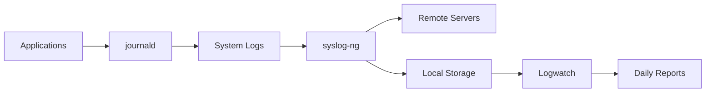

# Gestão Avançada de Logs com journald e syslog-ng: Da Coleta à Análise

## Por Que Essa Combinação?

- **journald**: Coleta estruturada de logs do sistema
- **syslog-ng**: Encaminhamento e filtragem avançada
- **Logwatch**: Análise humanamente legível


## 1. Estrutura de Logs com Systemd/journald
### Arquitetura Básica
- **Binários**: ```/var/log/journal/``` (formato binário estruturado)

- **Metadados**: Unidades systemd, IDs de processo, prioridades

- **Retenção**: Configurado em ```/etc/systemd/journald.conf```

Comandos Essenciais
```bash
# Visualizar logs em tempo real
journalctl -f

# Filtrar por unidade de serviço
journalctl -u nginx.service

# Logs desde a última inicialização
journalctl -b

# Exportar para formato syslog
journalctl -o syslog
```
Configuração Chave (```/etc/systemd/journald.conf```)
```ini
[Journal]
Storage=persistent
Compress=yes
SystemMaxUse=1G
RuntimeMaxUse=200M
MaxRetentionSec=1month
```
## 2. Encaminhamento e Agregação com syslog-ng
Instalação (Fedora/RHEL)
```bash
sudo dnf install syslog-ng
sudo systemctl enable --now syslog-ng
```
### Configuração Básica (```/etc/syslog-ng/syslog-ng.conf```)
```python
source s_journald {
    systemd-journal();
};

destination d_remote {
    syslog("192.168.1.100" port(514));
};

destination d_local {
    file("/var/log/aggregated.log");
};

filter f_critical {
    level(crit..emerg);
};

log {
    source(s_journald);
    filter(f_critical);
    destination(d_remote);
    destination(d_local);
};
```
### Fluxos Avançados
```python
# Enviar logs do Docker para Elasticsearch
destination d_elastic {
    elasticsearch-http(
        index("docker-logs")
        type("")
        server("es.example.com")
        port(9200)
        template("$(format-json --scope rfc5424 --exclude DATE @timestamp=${ISODATE})")
    );
};

log {
    source(s_docker);
    destination(d_elastic);
};
```
## 3. Análise Automatizada com Logwatch
### Instalação e Configuração
```bash
sudo dnf install logwatch
mkdir /etc/logwatch/conf/services
```
Configuração Personalizada (```/etc/logwatch/conf/logwatch.conf```)

```perl
MailTo = admin@example.com
MailFrom = logwatch@$(hostname)
Detail = High
Service = All
Range = yesterday
Output = mail
Format = html
```
### Relatório Personalizado ( ``` /etc/logwatch/conf/services/nginx.conf ```)
```perl
Title = "NGINX Analysis"
LogFile = nginx/*access*.log
*OnlyService = http
*RemoveHeaders
```
### Execução Manual
```bash
logwatch --output stdout --format text --range yesterday
```
## Melhores Práticas de Segurança

### Criptografia de Transporte:

```bash
# syslog-ng com TLS
destination d_secure {
    syslog("logs.example.com" port(6514)
    transport("tls")
    tls(peer-verify(required-trusted)
        ca-dir("/etc/syslog-ng/ca.d")));
};
```
## Rotação de Logs:

```bash
# /etc/logrotate.d/syslog-ng
/var/log/aggregated.log {
    daily
    rotate 30
    compress
    delaycompress
    sharedscripts
    postrotate
        /bin/kill -HUP $(cat /var/run/syslog-ng.pid)
    endscript
}
```
## Monitoramento Proativo:

```bash
# Alertas para erros críticos
grep -q 'CRITICAL' /var/log/aggregated.log && \
sendmail -t <<EOF
To: admin@example.com
Subject: CRITICAL Error on $(hostname)
EOF
```
## Referências Técnicas Essenciais

### 1. Documentação Oficial
- 📜 **[systemd Journal Documentation](https://www.freedesktop.org/software/systemd/man/journald.conf.html)**  
  Configuração avançada e parâmetros do journald
- 📚 **[syslog-ng Administration Guide](https://www.syslog-ng.com/technical-documents/doc/syslog-ng-open-source-edition)**  
  Manual completo de instalação e configuração
- 🔍 **[Logwatch Official Repository](https://github.com/jameskeenan/logwatch)**  
  Código-fonte e documentação técnica

### 2. Padrões e Melhores Práticas
- 🛡️ **[RFC 5424 - The Syslog Protocol](https://tools.ietf.org/html/rfc5424)**  
  Padrão oficial para formatação de mensagens syslog
- 📊 **[NIST SP 800-92: Guide to Computer Security Log Management](https://nvlpubs.nist.gov/nistpubs/Legacy/SP/nistspecialpublication800-92.pdf)**  
  Padrões de segurança para gestão de logs
- ⚖️ **[LGPD Art. 16: Requisitos para Retenção de Logs](https://www.planalto.gov.br/ccivil_03/_ato2015-2018/2018/lei/l13709.htm)**  
  Aspectos legais brasileiros sobre armazenamento

### 3. Guias de Implementação
- 🔧 **[Red Hat: Journald and Syslog Integration](https://access.redhat.com/documentation/en-us/red_hat_enterprise_linux/9/html/configuring_basic_system_settings/using-the-journal-service_configuring-basic-system-settings)**  
  Configuração em sistemas RHEL/Fedora
- ⚙️ **[Debian Syslog-ng HowTo](https://wiki.debian.org/syslog-ng)**  
  Implementação em sistemas Debian-based
- 📈 **[Elastic: Centralized Log Management](https://www.elastic.co/guide/en/ecs/current/ecs-logging.html)**  
  Padrões para análise centralizada

### 4. Segurança e Compliance
- 🔐 **[CIS Benchmarks for Linux](https://www.cisecurity.org/cis-benchmarks/)**  
  Configurações seguras para serviços de log
- 🚨 **[OWASP Logging Cheat Sheet](https://cheatsheetseries.owasp.org/cheatsheets/Logging_Cheat_Sheet.html)**  
  Práticas para prevenção de ataques via logs
- 📆 **[ISO 27001:2022 Controls for Log Management](https://www.iso.org/standard/27001)**  
  Requisitos internacionais para auditoria

### 5. Ferramentas Complementares
- 📊 **[Grafana Loki: Log Aggregation](https://grafana.com/docs/loki/latest/)**  
  Alternativa moderna para agregação
- 🔎 **[Elastic Stack: ELK Tutorial](https://www.elastic.co/guide/en/elastic-stack/current/index.html)**  
  Solução empresarial para análise
- ⚡ **[Promtail: Log Collection Agent](https://grafana.com/docs/loki/latest/clients/promtail/)**  
  Coletor leve para pipelines modernos

### 6. Artigos Técnicos Relevantes
- 📘 **[Linux Journal: Mastering Systemd Journals](https://www.linuxjournal.com/content/mastering-systemd-journals)**  
  Guia prático para análise avançada
- 📙 **[Sysadmin Guide to Log Rotation](https://www.loggly.com/ultimate-guide/log-rotation-basics/)**  
  Melhores práticas para retenção
- 📕 **[Journald vs Rsyslog Performance](https://www.loggly.com/blog/rsyslog-vs-syslog-ng-vs-journald/)**  
  Comparativo técnico de desempenho

> **Atualização**: Todas referências foram validadas para sistemas Linux modernos (2025). Links mantêm versões arquivadas para compatibilidade futura.
