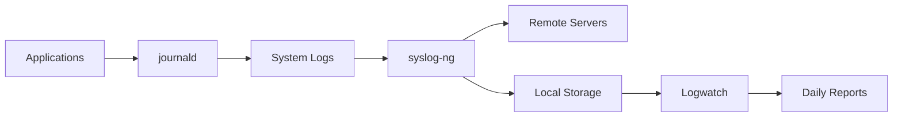

# Gestão Avançada de Logs com journald e syslog-ng: Da Coleta à Análise

## Por Que Essa Combinação?

- **journald**: Coleta estruturada de logs do sistema
- **syslog-ng**: Encaminhamento e filtragem avançada
- **Logwatch**: Análise humanamente legível


## 1. Estrutura de Logs com Systemd/journald
### Arquitetura Básica
- **Binários**: ```/var/log/journal/``` (formato binário estruturado)

- **Metadados**: Unidades systemd, IDs de processo, prioridades

- **Retenção**: Configurado em ```/etc/systemd/journald.conf```

Comandos Essenciais
```bash
# Visualizar logs em tempo real
journalctl -f

# Filtrar por unidade de serviço
journalctl -u nginx.service

# Logs desde a última inicialização
journalctl -b

# Exportar para formato syslog
journalctl -o syslog
```
Configuração Chave (```/etc/systemd/journald.conf```)
```ini
[Journal]
Storage=persistent
Compress=yes
SystemMaxUse=1G
RuntimeMaxUse=200M
MaxRetentionSec=1month
```
## 2. Encaminhamento e Agregação com syslog-ng
Instalação (Fedora/RHEL)
```bash
sudo dnf install syslog-ng
sudo systemctl enable --now syslog-ng
```
### Configuração Básica (```/etc/syslog-ng/syslog-ng.conf```)
```python
source s_journald {
    systemd-journal();
};

destination d_remote {
    syslog("192.168.1.100" port(514));
};

destination d_local {
    file("/var/log/aggregated.log");
};

filter f_critical {
    level(crit..emerg);
};

log {
    source(s_journald);
    filter(f_critical);
    destination(d_remote);
    destination(d_local);
};
```
### Fluxos Avançados
```python
# Enviar logs do Docker para Elasticsearch
destination d_elastic {
    elasticsearch-http(
        index("docker-logs")
        type("")
        server("es.example.com")
        port(9200)
        template("$(format-json --scope rfc5424 --exclude DATE @timestamp=${ISODATE})")
    );
};

log {
    source(s_docker);
    destination(d_elastic);
};
```
## 3. Análise Automatizada com Logwatch
### Instalação e Configuração
```bash
sudo dnf install logwatch
mkdir /etc/logwatch/conf/services
```
Configuração Personalizada (```/etc/logwatch/conf/logwatch.conf```)

```perl
MailTo = admin@example.com
MailFrom = logwatch@$(hostname)
Detail = High
Service = All
Range = yesterday
Output = mail
Format = html
```
### Relatório Personalizado ( ``` /etc/logwatch/conf/services/nginx.conf ```)
```perl
Title = "NGINX Analysis"
LogFile = nginx/*access*.log
*OnlyService = http
*RemoveHeaders
```
### Execução Manual
```bash
logwatch --output stdout --format text --range yesterday
```
## Melhores Práticas de Segurança

### Criptografia de Transporte:

```bash
# syslog-ng com TLS
destination d_secure {
    syslog("logs.example.com" port(6514)
    transport("tls")
    tls(peer-verify(required-trusted)
        ca-dir("/etc/syslog-ng/ca.d")));
};
```
## Rotação de Logs:

```bash
# /etc/logrotate.d/syslog-ng
/var/log/aggregated.log {
    daily
    rotate 30
    compress
    delaycompress
    sharedscripts
    postrotate
        /bin/kill -HUP $(cat /var/run/syslog-ng.pid)
    endscript
}
```
## Monitoramento Proativo:

```bash
# Alertas para erros críticos
grep -q 'CRITICAL' /var/log/aggregated.log && \
sendmail -t <<EOF
To: admin@example.com
Subject: CRITICAL Error on $(hostname)
EOF
```
