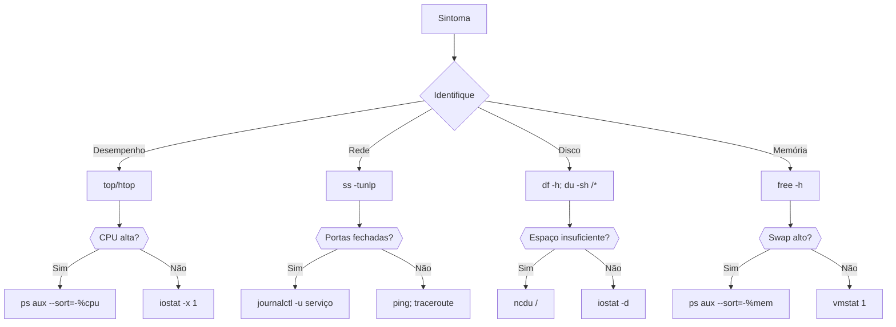

---
categories:
- tecnologia
- administração de sistemas
date: "2025-01-23T00:00:00Z"
title: 'Monitoramento de Sistemas Linux: Comandos Essenciais'
---

# Monitoramento de Sistemas Linux: Comandos Essenciais

Dominar ferramentas de monitoramento é crucial para administradores de sistemas Linux. Conheça os comandos fundamentais para diagnosticar desempenho, redes e recursos:

## 🖥️ 1. iostat (I/O Statistics)
**Função**: Monitora CPU e operações de disco  
**Instalação**:
```bash
# Debian/Ubuntu
sudo apt install sysstat

# Red Hat/CentOS
sudo yum install sysstat
```
**Uso**:

```bash

iostat -x 1 5  # Detalhes de I/O, atualiza a cada 1s (5 vezes)
```
## Saída-chave:

- **%util**: % de tempo do disco ocupado

- **await**: Tempo médio de espera por I/O (ms)

- **tps**: Transações por segundo

## 🌐 2. netstat (Network Statistics)
**Função**: Exibe conexões de rede e portas
**Instalação**:

```bash
# Debian/Ubuntu
sudo apt install net-tools
```
### Comandos úteis:

```bash
netstat -tuln    # Portas TCP/UDP em escuta
netstat -s       # Estatísticas por protocolo
netstat -r       # Tabela de roteamento
```
### Alternativa moderna:

```bash
ss -tunlp  # Equivalente com melhor performance
```
## 👥 3. w (**Who** & What)
**Função**: Mostra usuários logados e processos
**Exemplo**:

```bash
w  # Exibe: usuário, terminal, tempo idle, processo atual
```
## 📊 4. sar (System Activity Reporter)
**Função**: Coleta histórica de desempenho
**Uso**:

```bash
sar -u 2 5      # CPU a cada 2s (5 amostras)
sar -r 1 3      # Memória
sar -d -p 1 3   # Disco por dispositivo
```
## 🧩 5. ps (Process Status)
**Função**: Lista processos ativos
**Comando essencial**:

```bash
ps aux --sort=-%cpu | head  # Top 10 processos por CPU
```
**Campos importantes**:

- **PID**: ID do processo

- **%CPU**: Uso de CPU

- **%MEM**: Uso de memória

- **STAT**: Estado do processo

## 🚀 6. top (Task Manager)
**Função**: Monitoramento em tempo real
Atalhos dentro do top:
|---|
- **P**: Ordenar por CPU

- **M**: Ordenar por memória

- **k**: Matar processo

- **1**: Mostrar CPUs individuais

## 🧠 7. vmstat (Virtual Memory Stats)
**Função**: Analisa memória, processos e I/O
**Uso**:

```bash
vmstat 1  # Atualiza a cada 1 segundo
```
**Saída crítica*:

- ```si/so```: Swap in/out (alto = problema)

- ```us/sy```: % CPU user/system

- ```free```: Memória livre (KB)

## 💾 8. df (Disk Free)
**Função**: Espaço em sistemas de arquivos
**Exemplo**:

```bash
df -hT  # Legível + tipos de filesystem
```
## 📁 9. du (Disk Usage)
**Função**: Uso de espaço por diretório
**Comandos**:

```bash
du -sh /var/log  # Resumo do diretório
du -h --max-depth=1 /home  # Top-level
```
🧠 10. free (Memory Usage)
**Função**: Exibe uso de RAM e swap
**Uso**:

```bash
free -m  # Exibe em MB
free -h  # Formato legível
```
## 🔍 Fluxo de Diagnóstico 


## Dicas Profissionais
- 1.Log histórico: Configure ```sar``` para coleta diária (editando ```/etc/cron.d/sysstat```)

- 2.Monitoramento contínuo:

```bash
watch -n 2 'df -h; echo; free -h'  # Atualiza a cada 2s
```
- 3.Combinações poderosas:

```bash
# Top 5 processos consumindo memória
ps aux --sort=-%mem | head -6

# Conexões ESTABLISHED por IP
netstat -tun | grep 'ESTAB' | awk '{print $5}' | cut -d: -f1 | sort | uniq -c
```
**Importante**: Para troubleshooting, sempre comece com ```w```, ```top``` e ```free``` - dão visão geral imediata do sistema.

## 📚 Referências Essenciais

### Documentação Oficial
1. **sysstat (iostat/sar)**  
   [https://github.com/sysstat/sysstat](https://github.com/sysstat/sysstat)  
   Repositório oficial com manuais detalhados

2. **procps (ps/top/free)**  
   [https://gitlab.com/procps-ng/procps](https://gitlab.com/procps-ng/procps)  
   Documentação dos comandos de processos

3. **iproute2 (ss)**  
   [https://wiki.linuxfoundation.org/networking/iproute2](https://wiki.linuxfoundation.org/networking/iproute2)  
   Sucessor moderno do netstat

### Manuais Online
4. **Linux man pages online**  
   [https://man7.org/linux/man-pages/](https://man7.org/linux/man-pages/)  
   Documentação completa de todos os comandos

5. **TLDR Pages**  
   [https://tldr.sh/](https://tldr.sh/)  
   Exemplos rápidos de uso para cada comando

### Guias Avançados
6. **Linux Performance Analysis in 60s**  
   [https://netflixtechblog.com/linux-performance-analysis-in-60-000-milliseconds-accc10403c55](https://netflixtechblog.com/linux-performance-analysis-in-60-000-milliseconds-accc10403c55)  
   Fluxo de diagnóstico da Netflix

7. **Brendan Gregg's Blog**  
   [http://www.brendangregg.com/linuxperf.html](http://www.brendangregg.com/linuxperf.html)  
   Ferramentas e técnicas de performance por especialista da Netflix

### Livros Recomendados
8. **Linux Bible**  
   Christopher Negus (ISBN: 978-1119578888)  
   Capítulos 8-10 dedicados a administração e monitoramento

9. **The Linux Command Line**  
   William Shotts (Disponível gratuitamente em: [https://linuxcommand.org/tlcl.php](https://linuxcommand.org/tlcl.php))

### Ferramentas Relacionadas
10. **Prometheus + Grafana**  
    [https://prometheus.io/](https://prometheus.io/)  
    Monitoramento moderno baseado em métricas

11. **htop**  
    [https://htop.dev/](https://htop.dev/)  
    Versão melhorada do top com interface colorida

### Documentação Oficial
12. **sysstat (iostat/sar)**  
   [https://github.com/sysstat/sysstat](https://github.com/sysstat/sysstat)  
   Manuais completos e exemplos avançados

13. **procps (ps/top/free)**  
   [https://gitlab.com/procps-ng/procps](https://gitlab.com/procps-ng/procps)  
   Documentação oficial dos comandos de processos

14. **Diagramas Mermaid**  
   [Documentação do GitHub](https://docs.github.com/get-started/writing-on-github/working-with-advanced-formatting/creating-diagrams#creating-mermaid-diagrams)  
   Guia completo para criação de diagramas técnicos

### Manuais e Guias
15. **Linux man pages online**  
   [https://man7.org/linux/man-pages/](https://man7.org/linux/man-pages/)  
   Referência autoritativa de todos os comandos

16. **Linux Performance Analysis in 60s**  
   [Netflix TechBlog](https://netflixtechblog.com/linux-performance-analysis-in-60-000-milliseconds-accc10403c55)  
   Metodologia prática para diagnóstico rápido

### Ferramentas Avançadas
17. **Prometheus + Grafana**  
   [https://prometheus.io/](https://prometheus.io/)  
   Monitoramento moderno baseado em métricas

18. **Brendan Gregg's Tools**  
   [http://www.brendangregg.com/linuxperf.html](http://www.brendangregg.com/linuxperf.html)  
   Coleção de ferramentas e técnicas de performance

### Livros Recomendados
19. **Linux Performance Tuning**  
   ISBN: 978-1492053500  
   Capítulos essenciais sobre monitoramento e otimização

20. **The Linux Command Line**  
   [Download gratuito](https://linuxcommand.org/tlcl.php)  
   Seções 10-12 dedicadas a administração de sistemas
